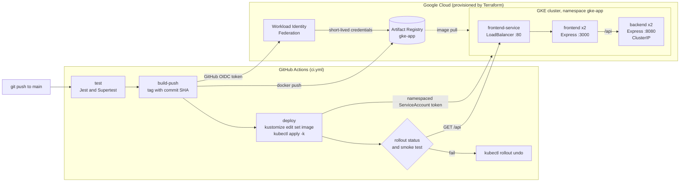

# GKE Kubernetes

**A production-style GKE delivery pipeline as code, from Terraform to a verified rollout.**

[](https://github.com/CodeMongerrr/GKE-Kubernetes/actions/workflows/ci.yml)
[](https://github.com/CodeMongerrr/GKE-Kubernetes/releases)
[](LICENSE)
[](infrastructure/terraform)
[](k8s)
[](https://cloud.google.com/kubernetes-engine)

A two-tier Node.js app (an Express frontend and an Express API) is the payload. The point of the repo is everything around it. Terraform provisions the GKE cluster and a keyless identity for CI, Kustomize describes each environment, and one GitHub Actions workflow tests, builds, pushes to Artifact Registry and deploys. Every deploy is checked against the live LoadBalancer and rolled back automatically if the new commit is not the one serving traffic.

The full pipeline ran against a live cluster on 23 June 2026, with the smoke test passing on both deploys ([run 28019562234](https://github.com/CodeMongerrr/GKE-Kubernetes/actions/runs/28019562234), [run 28022394760](https://github.com/CodeMongerrr/GKE-Kubernetes/actions/runs/28022394760)). The cluster is torn down between demos to avoid billing, so there is no permanent public URL.

## What it demonstrates

| Pattern | Where | What it buys you |
| --- | --- | --- |
| Smoke test with automatic rollback | `.github/workflows/ci.yml`, deploy job | After `kubectl apply` the job waits for both rollouts, then polls the public LoadBalancer until the frontend and the backend both report the commit that was just pushed. If either check fails within two minutes it runs `kubectl rollout undo` on both Deployments and fails the job. |
| Commit-pinned images | `ci.yml`, both Dockerfiles, `/version` endpoints | Each image is tagged with the Git SHA and has the SHA baked in, so "which build is live" is a curl away and every deploy is a real PodSpec change. |
| PodDisruptionBudgets | `k8s/base/*-pdb.yaml` | `minAvailable` of 1 per tier, so node drains and GKE upgrades never evict every replica at once. |
| Pod anti-affinity | `k8s/base/*-deployment.yaml` | Preferred (soft) anti-affinity on `kubernetes.io/hostname` spreads replicas across nodes and still lets the autoscaler place extra pods. |
| Fail-fast rolling updates | `k8s/base/*-deployment.yaml` | `maxSurge` 0 and `maxUnavailable` 1 fit small nodes, and `progressDeadlineSeconds` of 120 turns a stuck rollout into a failed one that triggers rollback. |
| Probes, requests and autoscaling | `k8s/base` | Readiness and liveness probes, CPU and memory requests and limits, and an HPA per tier that targets 50 percent CPU. `k8s/loadgen.yaml` drives it. |
| Environment overlays | `k8s/overlays/{dev,prod,cd}` | One base, three overlays. The `cd` overlay drops the Namespace object so the CI identity only needs namespaced RBAC. |
| Keyless image push | `infrastructure/terraform/cicd.tf` | GitHub OIDC is exchanged for short-lived Google credentials through Workload Identity Federation, limited to this repository and its `main` branch. No service account key exists. |
| Least-privilege deployer | `k8s/cd-rbac.yaml` | The deploy job talks to the Kubernetes API as a ServiceAccount whose Role covers only the app's resources in `gke-app`. |

## Architecture



Terraform owns the cluster, its autoscaled node pool, the required Google APIs, the Artifact Registry repository and the whole Workload Identity Federation chain (pool, provider, deployer service account and its registry binding). Kustomize owns everything inside the cluster.

## Repository structure

```text
GKE-Kubernetes/
├── .github/workflows/ci.yml     # test, build-push, deploy with smoke test and rollback
├── backend/                     # Express API (/, /version, /health, /load) and Jest tests
├── frontend/                    # Express server, static page, /api proxy to the backend, Jest tests
├── infrastructure/terraform/
│   ├── main.tf                  # APIs, GKE cluster, autoscaled node pool
│   ├── cicd.tf                  # Artifact Registry and Workload Identity Federation for GitHub
│   ├── variables.tf
│   └── outputs.tf
├── k8s/
│   ├── base/                    # Deployments, Services, HPAs, PDBs, Namespace
│   ├── overlays/
│   │   ├── dev/                 # Artifact Registry images, 1 replica per tier
│   │   ├── prod/                # template, 3 replicas per tier
│   │   └── cd/                  # used by CI, no Namespace object
│   ├── cd-rbac.yaml             # deployer ServiceAccount, Role, RoleBinding, token
│   ├── loadgen.yaml             # optional load generator to watch the HPA scale
│   └── rendered-dev.yaml        # pre-rendered manifests used by scripts/up.sh
└── scripts/
    ├── up.sh                    # quick gcloud path, 2 x e2-small cluster plus app
    ├── down.sh                  # deletes that cluster
    └── cd-bootstrap.sh          # creates deployer RBAC and sets the K8S_* repo secrets
```

## Prerequisites

- A Google Cloud project with billing enabled, and permission to create GKE, IAM and Artifact Registry resources
- [gcloud](https://cloud.google.com/sdk/docs/install) with the `gke-gcloud-auth-plugin` component
- [Terraform](https://developer.hashicorp.com/terraform/install) 1.5 or newer
- kubectl 1.27 or newer (it ships Kustomize, so `kubectl apply -k` and `kubectl kustomize` work without a separate install)
- Docker with Buildx, to seed the first images
- Node.js 20 or newer and npm, to run the tests locally
- [GitHub CLI](https://cli.github.com), used by `scripts/cd-bootstrap.sh` to set repository secrets

## Try it locally first

No cloud account is needed for this part.

```bash
# unit tests (5 per service)
(cd backend  && npm ci && npm test)
(cd frontend && npm ci && npm test)

# render every overlay without a cluster
for o in dev prod cd; do kubectl kustomize k8s/overlays/$o > /dev/null && echo "$o ok"; done

# run both tiers and call the same endpoint the CI smoke test calls
(cd backend  && PORT=8080 GIT_SHA=local node src/index.js) &
(cd frontend && PORT=3000 GIT_SHA=local BACKEND_URL=http://127.0.0.1:8080 node src/server.js) &
curl -s http://127.0.0.1:3000/api | jq '{frontendCommit, backendCommit: .backend.commit}'
```

## Deploy to GKE

### 1. Point gcloud and Terraform at your project

```bash
gcloud auth login
gcloud auth application-default login
gcloud config set project YOUR_PROJECT_ID
```

### 2. Provision the infrastructure with Terraform

```bash
cd infrastructure/terraform
terraform init
terraform plan \
  -var="project_id=YOUR_PROJECT_ID" \
  -var="github_repository=YOUR_GITHUB_USER/GKE-Kubernetes"
terraform apply \
  -var="project_id=YOUR_PROJECT_ID" \
  -var="github_repository=YOUR_GITHUB_USER/GKE-Kubernetes"
terraform output
```

The defaults create a zonal cluster named `gke-app-cluster` in `us-central1-a` with two `e2-medium` nodes (autoscaling up to five) and an Artifact Registry repository named `gke-app` in `asia-southeast1`. Pass `-var="ar_location=us-central1"` to keep images in the same region as the cluster. If the registry already exists, pass `-var="create_ar_repository=false"`.

### 3. Connect kubectl

```bash
gcloud container clusters get-credentials gke-app-cluster --zone us-central1-a
kubectl get nodes
```

### 4. Seed the first images

After this, CI builds and pushes on every commit to `main`. Build for `linux/amd64` because GKE nodes are amd64.

```bash
AR=REGION-docker.pkg.dev/YOUR_PROJECT_ID/gke-app
gcloud auth configure-docker REGION-docker.pkg.dev
docker build --platform linux/amd64 -t $AR/backend:dev  ./backend
docker build --platform linux/amd64 -t $AR/frontend:dev ./frontend
docker push $AR/backend:dev
docker push $AR/frontend:dev
```

### 5. Deploy with Kustomize

Set the `newName` image paths in `k8s/overlays/dev/kustomization.yaml` and `k8s/overlays/cd/kustomization.yaml`, and `AR_REPO` in `.github/workflows/ci.yml`, to your registry. Then apply the dev overlay and check that both tiers answer through the LoadBalancer.

```bash
kubectl apply -k k8s/overlays/dev
kubectl -n gke-app rollout status deployment/backend
kubectl -n gke-app rollout status deployment/frontend
IP=$(kubectl -n gke-app get svc frontend-service -o jsonpath='{.status.loadBalancer.ingress[0].ip}')
curl -s http://$IP/api | jq
```

### 6. Turn on continuous deployment

```bash
./scripts/cd-bootstrap.sh   # needs admin kubectl access and gh auth for this repo
```

Then add the repository variables under Settings, Secrets and variables, Actions.

| Name | Kind | Used by | Value |
| --- | --- | --- | --- |
| `GCP_WORKLOAD_IDENTITY_PROVIDER` | variable | build-push | `terraform output github_workload_identity_provider` |
| `GCP_DEPLOY_SA` | variable | build-push | `terraform output github_deployer_sa_email` |
| `CD_ENABLED` | variable | build-push, deploy | `true` only while a cluster is running |
| `K8S_SERVER` | secret | deploy | set by `scripts/cd-bootstrap.sh` |
| `K8S_CA` | secret | deploy | set by `scripts/cd-bootstrap.sh` |
| `K8S_TOKEN` | secret | deploy | set by `scripts/cd-bootstrap.sh` |

Push to `main` or start the workflow by hand from the Actions tab. With `CD_ENABLED` unset the build and deploy jobs are skipped and the run still passes, and commits that only touch Markdown or the license skip the pipeline entirely.

### Faster path for a quick demo

`scripts/up.sh` skips Terraform and creates a cluster named `gke-app` with `gcloud` (two `e2-small` nodes, 30 GB disks) and applies `k8s/rendered-dev.yaml`. `scripts/down.sh` deletes it. Re-run `scripts/cd-bootstrap.sh` after every recreate because the endpoint, CA and token change.

## Teardown and cost

```bash
kubectl delete namespace gke-app   # releases the LoadBalancer and its external IP first
cd infrastructure/terraform
terraform destroy \
  -var="project_id=YOUR_PROJECT_ID" \
  -var="github_repository=YOUR_GITHUB_USER/GKE-Kubernetes"
```

Set `CD_ENABLED` back to empty and delete the `K8S_*` secrets once the cluster is gone. `terraform destroy` also deletes the Artifact Registry repository and its images when Terraform created it.

Rough on-demand list prices in `us-central1`, before tax. Check the [Google Cloud pricing calculator](https://cloud.google.com/products/calculator) for your region.

| Setup | Per hour | Per month if left running |
| --- | --- | --- |
| Terraform defaults, 2 x e2-medium | about $0.11 | about $80 |
| `scripts/up.sh`, 2 x e2-small | about $0.07 | about $50 |
| Single e2-medium Spot node | about $0.04 | about $30 |

The LoadBalancer and its IP are roughly $22 of every monthly figure. The GKE cluster fee of $0.10 an hour is covered by the free tier credit for one zonal or Autopilot cluster per billing account. A two hour demo on the quick path costs well under a dollar.

## Limitations and roadmap

- **No permanent demo.** The cluster exists only while a demo is running. Job logs from the June 2026 deploys have expired, and the run history above is the lasting record.
- **Rollback is untested in anger.** The rollback path is implemented but no deploy has failed yet. A `workflow_dispatch` rollback drill that ships a deliberately bad image is next.
- **Deploy credentials are long lived.** The deploy job uses a ServiceAccount token stored as a GitHub secret. Moving it to Workload Identity Federation with `get-gke-credentials` would remove the last stored credential.
- **Two provisioning paths.** Terraform and `scripts/up.sh` create differently named and sized clusters. Terraform is the reference, and the script is a shortcut.
- **Registry and cluster default to different regions**, which means cross-region image pulls unless `ar_location` is changed.
- **HPA and fixed replica counts overlap.** Each apply resets replicas to the manifest value until the HPA scales again, and in the dev overlay the HPA minimum of two overrides the one-replica patch.
- **Terraform state is local** and the control plane is public. A GCS backend, a dedicated least-privilege node service account and authorized networks are on the list.
- **The prod overlay is a template** with placeholder image paths.

## License

Released under the [MIT License](LICENSE).

## Author

Built by Aditya Joshi. [GitHub](https://github.com/CodeMongerrr) · [joshionchain.com](https://www.joshionchain.com)
